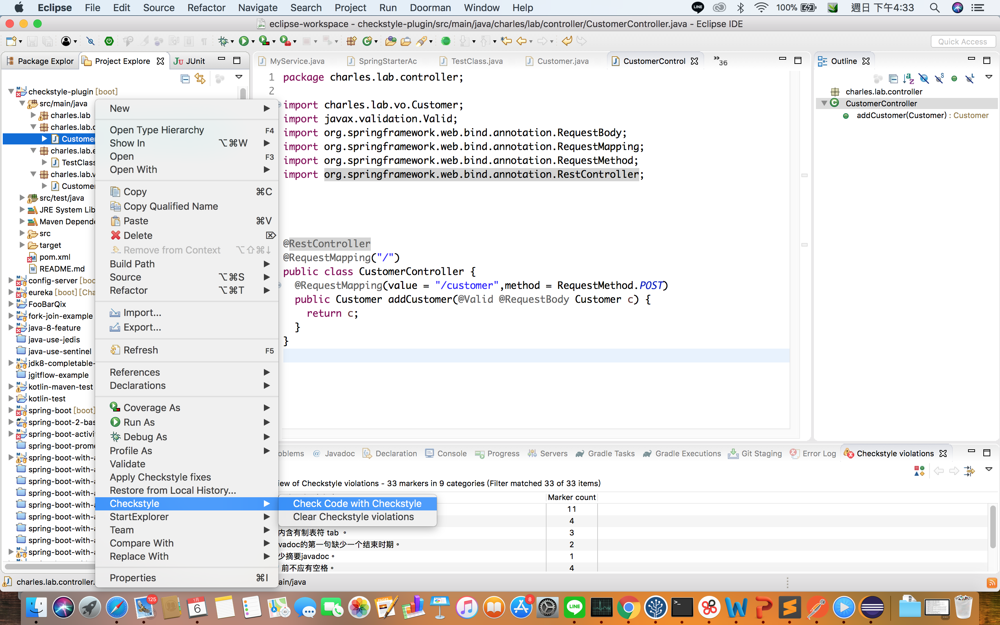

# Install Eclipse check style plugin
## Download plugin
[checkstyle-plugin](https://checkstyle.org/eclipse-cs/#!/)

## How to install
Help -> Install New Software... -> Add.. -> choice plugin zip and install

## How to use
At project or java file right click-> Checkstyle -> check code with ckeckstyle

## How to auto scan
At project right click -> Checkstyle -> Activative Checkstyle.
When you modify file, eclipse will auto scan.

